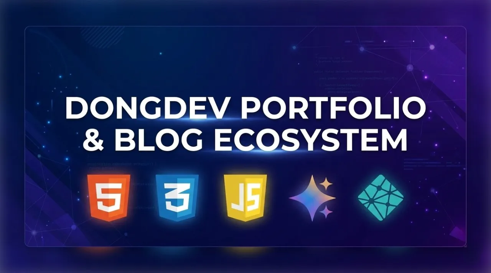
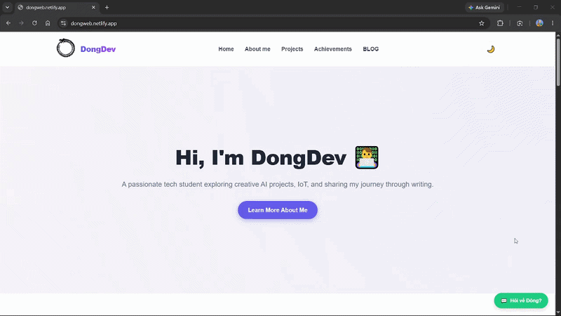
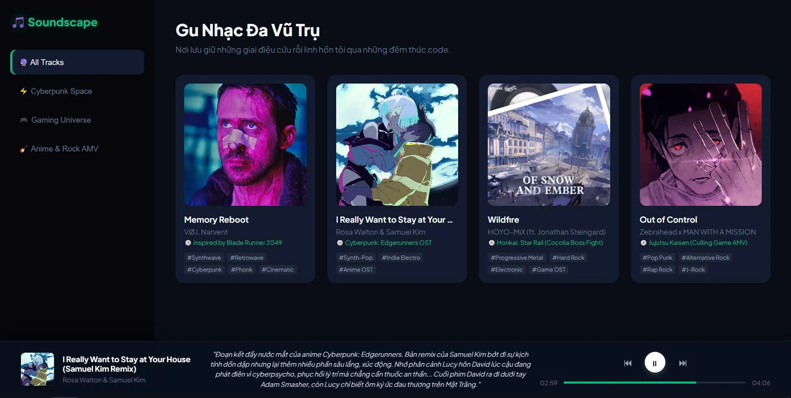

```markdown
# 🚀 DongDev Portfolio & Blog Ecosystem
```

<p align="center">
  
</p>

<p align="center">
  
    
  
  
  
  
</p>

```markdown
Welcome to the central monorepo of **DongDev**, an all-in-one personal portfolio and technical blog platform. This repository showcases an array of web development applications alongside a performance-optimized, serverless blog interface built using a clean vanilla engineering approach.

---

## 🌟 Architecture & Features

This project bypasses heavy framework overhead by relying purely on a modern **Vanilla Tech Stack (HTML5, CSS3, JavaScript)** paired with serverless edge architecture and AI integrations:

* **Modular Portfolio Showcases:** Houses individual, independent applications ranging from interactive multimedia (**Music App**), arcade logic (Blackjack), to educational utilities (Passenger Counter) and hardware-software interfaces (Arduino).
* **Intelligent AI Assistant (Gemini AI Chatbot):** Features a smart assistant operating via Netlify Serverless Functions. It utilizes an optimized **Server-Side Fallback Orchestration Chain** (`gemini-2.5-flash-lite` ➔ `gemini-2.5-flash` ➔ `gemini-3.5-flash`). Processing fallbacks natively within the cloud environment guarantees uninterrupted user conversations even during severe Google API load spikes.
* **Persistent Global Dark/Light Mode:** A system-wide visual toggle with state management synchronized seamlessly through browser `localStorage` variables.
* **Decoupled Assets Management:** Scalable directory structure split into dedicated material folders to isolate graphics, custom stylesheets, and media configurations per entity.
* **Scoped LocalStorage Comment System:** Orchestrated centrally by `/script/blog.js`. It dynamically parses unique routing slugs from `window.location.pathname` to construct separate key-value structures, keeping comment sections fully isolated across different posts.
* **Serverless Notifications (Web3Forms API Integration):** Sends automated, instantaneous email logs straight to the admin's inbox whenever a reader drops a message through the contact form.

---

## 🔒 Security Gateways & Guardrails

To defend the system against exploitation, heavy API rate-limiting penalties, and malicious bot traffic, the repository applies strict engineering safety barriers:

* **Single-Use Cryptographic Tokens (Cloudflare Turnstile):** The Gemini chatbot gateway implements server-side token verification inside Netlify Functions. Because Cloudflare Turnstile enforces a strict one-time-use rule per token, moving the AI model iteration cycle to the server prevents **403 Replay Attack** errors. The token is checked exactly once, allowing multiple backend model fallbacks safely.
* **Anti-Spam Form Protection (hCaptcha):** General contact forms deploy custom interactive **hCaptcha** challenge puzzles to filter out remote headless browser injection attacks before parsing payloads to Web3Forms.
* **Cross-Site Scripting (XXSS) Sanitization:** Custom string-escaping helper utilities clean user input vectors before inserting text into the active client DOM.
* **Anti-Clickjacking Framing Defenses:** Explicit UI frame breaking breaks out of external embedded layouts or malicious iframes by enforcing parent window synchronization via `window.top.location`.

---

## 📂 True Project Architecture

```text
├── .vscode/                     # Local IDE workspace preferences
├── .gitignore                   # Version control exclusions
├── index.html                   # Core portfolio homepage & landing index
├── README.md                    # System documentation
│
├── assets/                      # Decoupled media bundles per entity
│   ├── Arduino-materials/
│   ├── blackjack-materials/
│   ├── blog-materials/
│   ├── businesscard-materials/
│   ├── counting-app-materials/
│   ├── GIFt-materials/
│   ├── google-materials/
│   ├── index-materials/
│   ├── musics-materials/         # Assets specifically allocated for the Music App
│   └── space-materials/
│
├── blog/                        # Technical writing collection
│   ├── edge-ai.html             # Edge AI deep dives
│   ├── index.html               # Main blog listing hub
│   ├── lcd-applying.html        # Custom physical hardware interaction post
│   ├── openclaw-part1.html      # OpenClaw implementation documentation
│   ├── smart-home.html          # IoT & automation concepts
│   └── top-scorer.html          # "Lightning Strikes Twice" editorial
│
├── netlify/                     # Serverless edge function workflows
│   └── functions/
│       └── gemini.js            # Secure serverless gateway & fallback runner for Google Gemini APIs
│
├── projects/                    # Specialized mini-applications
│   ├── blackjack.html
│   ├── businesscard.html
│   ├── GIFt.html
│   ├── google.com.html
│   ├── music-app.html           # Core Music Player UI layout
│   ├── passenger-counter.html
│   └── space.html
│
├── script/                      # Client-side behavioral logic
│   ├── blackjack.js
│   ├── blog.js                  # Global comment system core engine
│   ├── index.js                 # Global landing, theme controller & chatbot UI logic
│   ├── music-app.js             # Native HTML5 Audio API orchestration layers
│   └── pc.js
│
└── styles/                      # Scoped presentation layers
    ├── bcstyles.css
    ├── blackjack.css
    ├── blogstyles.css           # Typography, layout, and comments styles for the blog
    ├── GIFt-styles.css
    ├── googlestyles.css
    ├── music-app.css            # Scoped design system for the Music App
    ├── pc-styles.css
    ├── spacestyles.css
    └── styles.css               # Core global landing page & theme layouts

```

---

``` markdown

# 🤖 Demo Chatbot & Dark Mode

```





``` markdown

# 🎧 Music App User Interface

```

<p align="center">

  

</p>

---

## 🛠 Local Deployment & Environment Setup

### 1. Running Locally with Serverless Functions

To properly test both the client layout and the Gemini Chatbot back-end locally, you must simulate the runtime environment using the Netlify CLI:

```bash
# Install Netlify CLI globally (if not done yet)
npm install netlify-cli -g

# Start the local development server (reads local functions and .env)
netlify dev

```

*The ecosystem will spin up on `http://localhost:8888` by default.*

### 2. Configuration & Environment Variables

Create a `.env` file in your root workspace directory to host development keys. **Never commit this file to version control systems (GitHub).**

```env
GEMINI_API_KEY=AIzaSyYourActualValidKeyFromGoogleAIStudio
TURNSTILE_SECRET_KEY=1x00000000000000000000AAMovieKeyForLocalhostTesting

```

* **Production Deploys:** When deploying to production live servers, inject these exact variable keys straight into the **Netlify Dashboard -> Site Configuration -> Environment Variables** settings console to ensure runtime hydration.
* **Turnstile Safeguard:** The application auto-detects `localhost` loops and routes to Cloudflare’s standard development keys (`1x00000000000000000000AA`). Ensure production site keys match your production domain records.

---

## 📝 Roadmap & Current Highlights

* **AI Agents:** Deploying standalone OpenClaw setups inside cloud instances (AWS EC2) locked down behind private overlay networks (Tailscale networks + loopback bindings).
* **Interactive Labs:** Continuously extending the `/projects/` sub-tier with pure JavaScript-driven interactive application mechanics.
* **Performance Tuning:** Audit native script execution to keep global bundle delivery lightweight and lightning-fast.

---

## 📄 License & DMCA Protection

<p align="left">
  <a href="https://www.dmca.com/Protection/Status.aspx?ID=49597ff2-a0da-495b-8790-706abebe31ac&refurl=https://dongweb.netlify.app/" title="DMCA.com Protection Status" target="_blank">
    
  </a>
</p>

Maintained under personal codebase copyrights by **Duong Phuong Dong (DongDev)**. 

🔒 **Digital Millennium Copyright Act (DMCA) Safeguard:**
This repository, including all custom application architectures, blog contents, structural CSS design systems, and visual assets, is officially protected under the **DMCA**. 

* **Allowed:** This repository is public **strictly** for educational purposes, technical open-source code review, and portfolio evaluation.
* **Prohibited:** Any unauthorized cloning, redistribution, public deployment for personal portfolio identity, or commercial harvesting of this system's structural layout without explicit written consent is strictly forbidden. 

> ⚠️ **Enforcement Notice:** Infringements, plagiarized mirrors, or direct asset cloning will be met with immediate, automated DMCA Takedown notices issued directly to GitHub and hosting providers (Netlify, Vercel, Cloudflare, etc.), which may result in permanent repository deletion and SEO blacklisting.

If this multi-project directory layout provides inspiration for your work, drop a ⭐ Star on the repository!

---

*Built with precision by DongDev in 2026.*